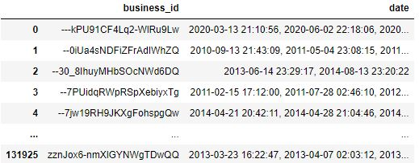

# <h1 align="center">**`CALIDAD DEL DATO`**</h1>

## Data de google maps 

se puede observar que los datos de reviews estan agrupados por cada uno de los estados de USA  en carpetas divivida en diferenctes archivos. 

Se crea una funcion la cual lee y concatena todos los archivo formando un dataframe por estado  

### Vemos que cada dataframe cuenta con 8 columnas y que tiene una relacion con la metadata por "gmap_id"

### ! Tambien se pueden ver algunos datos nulos

### En la metadata se puede ver que estan todos los datos referentes al comercio

### no se observan datos nulos significativos en los campos de interez 

*** 

## Data Yelp

En primer lugar se observa multiples archivos en diferentes formatos y tamaños 

### Business.pkl el cual contiene datos referentes a los comercios y se relaciona con los demas 'business_id' 

### Checkin.json  el cual contiene datos de reservas   

### Review.json  el cual tiene las reseñas, ademas tiene una relacion por 'business_id' y 'user_id'

