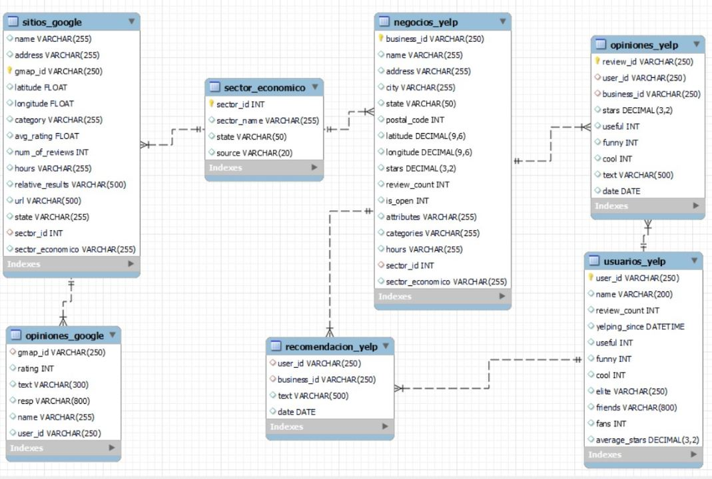
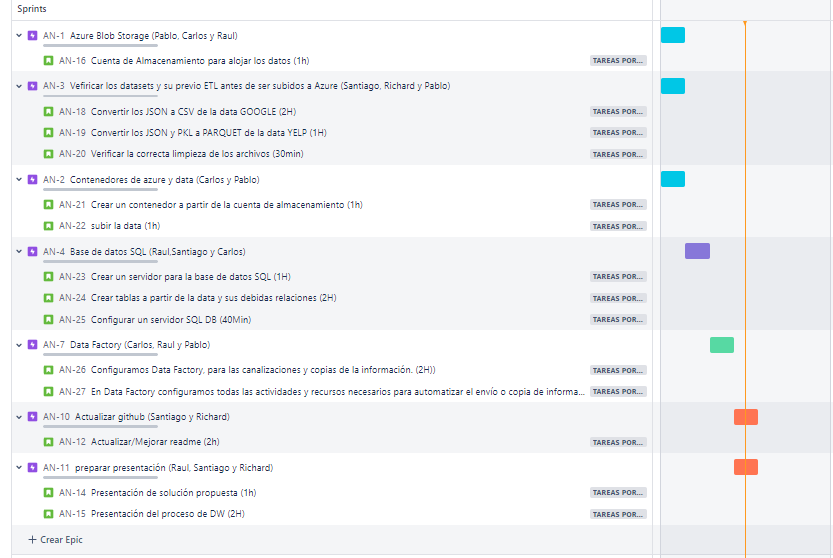
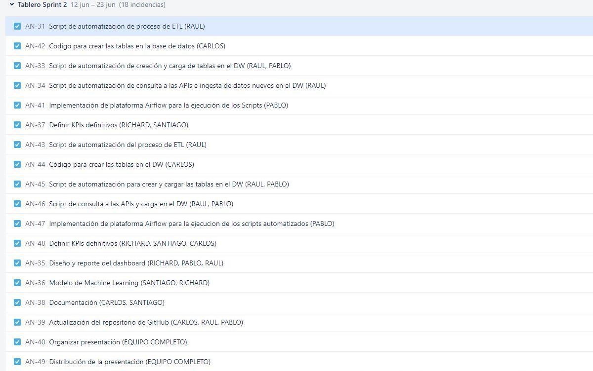

# <h1 align="center">**`YELP & GOOGLE MAPS`**</h1>

## **Contexto:**  Identificación de Sectores Económicos para Inversiones Rentables
Nuestro cliente es un inversor perteneciente a un conglomerado que se enfrenta al desafío de identificar los sectores económicos más prometedores para realizar inversiones rentables.

## **Propuesta de Trabajo:** Análisis de Reseñas de Usuarios y Generación de Conocimientos
Proponemos utilizar el histórico de reseñas de usuarios recopiladas de plataformas populares como Google y Yelp. A través del análisis y exploración de estos datos, buscamos obtener información valiosa que pueda ser aprovechada para generar conocimientos predictivos y estratégicos. Para lograr esto, emplearemos algoritmos avanzados de aprendizaje automático (Machine Learning) que nos permitirán extraer patrones y tendencias de las opiniones de los usuarios.

## **Equipo**

| **Rol** | **Nombre** | **Github** |
|:---:|:---:|---|
| _Data Engineer_ | Pablo Martinez | @Martinez-Pablo |
| _Data Engineer_ | Raul Abelleira | @rulomak |
| _Data Engineer_ | Carlos Sanchez | @CASA27 |
| _Data Analyst & Machine learning_ | Richard Libreros | @CAOZRICH |
| _Data Analyst & Machine learning_ | Santiago Valor | @santivalor |

***

## **Diagrama de entidad relacion SQL**

***

## **Planificacion**
### **Semana 2**

### **Enlaces**

[>>> Calidad de los datos ](CalidadDeDatos/readme.md)

[>>> Diccionario de datos ](Diccionario%20de%20datos/diccionario.md)

[>>> Datos complementarios ](Datos_complementarios_APIs/README.md)

***

### **Semana 3**

### **Enlaces**

[>>> Pipelines ](Pipeline_local/readme.md)

[>>> Video de ETL mediante los pipelines ](https://www.youtube.com/watch?v=79StfoUALyE)

[>>> Segmentacion por categorias ](clasificacion%20de%20categorias/README.md)

[>>> Funciones de clusterizacion ](Pipeline_local/clustering.py)

[>>> Modelo ML ](Modelo_ML/README.md)

[>>> Dashboard  ](https://app.powerbi.com/view?r=eyJrIjoiZDkzMjAxM2QtMjY5Mi00ZWJmLTg2NTQtYWM4MWY1NTcwY2E3IiwidCI6ImY1ODQzMWRmLTMyNDUtNGIyMi04NjQ1LTVmZmY5ODc0NjY3MiIsImMiOjR9)

## **KPIs**

**Aumentar la cantidad de reseñas en un 30% para el último mes respecto al mes anterior**

Descripción: Este KPI mide el crecimiento porcentual de la cantidad de reseñas en comparación con el mes anterior. El objetivo es aumentar las reseñas en un 30% para mantener un flujo constante de feedback de los usuarios.

Fórmula:
Primero, calcula la cantidad de reseñas para el último mes (ReseñasMesActual).
Luego, calcula la cantidad de reseñas para el mes anterior (ReseñasMesAnterior).
Finalmente, utiliza la fórmula: ((ReseñasMesActual - ReseñasMesAnterior) / ReseñasMesAnterior) * 100

**Mantener un promedio superior a 3.5 de rating el último mes**

Descripción: Este KPI se centra en el promedio de calificaciones de los locales. El objetivo es mantener un promedio de rating superior a 3.5 para garantizar la satisfacción general de los usuarios.

Fórmula: Calcula el promedio de rating para el último mes y compáralo con 3.5.

**Aumentar la cantidad de locales en 300 para el último mes**

Descripción: Este KPI se enfoca en el crecimiento de la base de datos de locales. El objetivo es agregar 300 nuevos locales al dataset durante el último mes para expandir la cobertura y ofrecer más opciones a los usuarios.

Fórmula: Calcula la cantidad de locales nuevos agregados durante el último mes y compáralo con 300.

**Aumentar el número de reseñas positivas en un 50% para el último mes respecto al mes anterior**

Descripción: Este KPI se centra en el aumento de las reseñas positivas, lo que indica una buena experiencia de los usuarios. El objetivo es incrementar en un 50% la cantidad de reseñas positivas en comparación con el mes anterior.

Fórmula:
Primero, calcula la cantidad de reseñas positivas para el último mes (ReseñasPositivasMesActual).
Luego, calcula la cantidad de reseñas positivas para el mes anterior (ReseñasPositivasMesAnterior).
Finalmente, utiliza la fórmula: ((ReseñasPositivasMesActual - ReseñasPositivasMesAnterior) / ReseñasPositivasMesAnterior) * 100
Recuerda que las fórmulas y medidas específicas dependerán de la estructura y columnas de tu conjunto de datos. Asegúrate de adaptarlas según corresponda.

*** 

## **Fuentes de datos**

Fuentes de datos principales:
+   [Dataset de Google Maps](https://drive.google.com/drive/folders/1Wf7YkxA0aHI3GpoHc9Nh8_scf5BbD4DA?usp=share_link)
+   [Dataset de Yelp!](https://drive.google.com/drive/folders/1TI-SsMnZsNP6t930olEEWbBQdo_yuIZF?usp=sharing)

Fuentes de datos complementarias:
+   [Yahoo Finance](https://finance.yahoo.com/)
+   [Market Watch](https://marketwatch.com)

***

## **Herramientas y tecnologicas:**

  
  
  

  
  
  

***