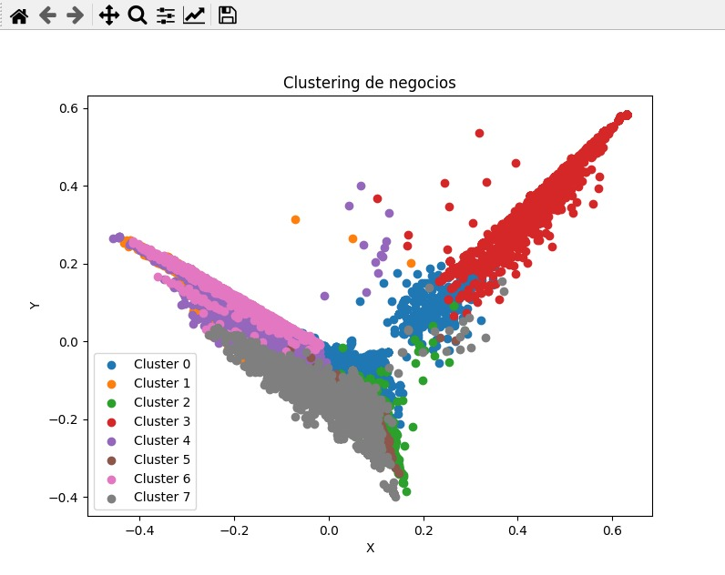

## **Segmentacion por categorias**   

---

Se realiza un proceso de segmentacion por categorías. Utiliza el algoritmo K-Means para encontrar similitudes entre las etiquetas y agruparlas en clusters.

* 1  Lee el archivo de datos que contiene información sobre los negocios. Luego, selecciona una muestra aleatoria de los datos y elimina las filas que no tienen información de categorías.

* 2 Se procesan las categorías para eliminar caracteres innecesarios y se identifican las categorías únicas presentes en los datos.

* 3 Se aplica el algoritmo de vectorización Tfidf a las categorías para convertirlas en valores numéricos.

* 4 Se utiliza el algoritmo K-Means para agrupar las categorías en clusters. Se asigna a cada etiqueta de negocio el cluster al que pertenece.

* 5 Para mejorar la interpretación de los clusters, se realiza una asignación de nombres a los clusters mediante un diccionario.

* 6 Se cambia el nombre de la columna 'cluster' a 'sector_economico'.

Por último, se genera un gráfico que proporciona una visualización de cómo están distribuidas las categorías y clusters, mostrando la cantidad de negocios en cada uno.

