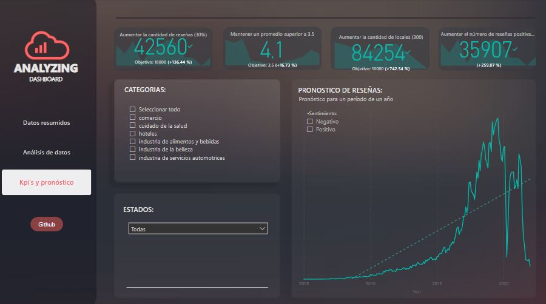

### En este dashboard, se presenta un análisis exhaustivo de las reseñas dejadas en Google y Yelp, permitiendo su discriminación por categoría y estado.

***

1.	**Resumen de datos:**
En esta sección, se muestran diversas métricas, como el total de reseñas, el número total de negocios, el porcentaje de negocios con una calificación de 5 y el promedio de calificaciones. Además, se destaca el porcentaje de reseñas por categoría, revelando que el 58% de las reseñas corresponden a hoteles, mientras que el 28% pertenece a la categoría de cuidado personal.

--- 

2.	**Análisis de datos:**
En este apartado, se visualiza la cantidad de reseñas positivas, que representa el 81.85% cuando se consideran las categorías de positivas y muy positivas. Por otro lado, un 11.17% de las reseñas son negativas si se toman en cuenta las categorías de negativas y muy negativas. Además, se observa un 6.98% de reseñas neutrales. En la esquina inferior derecha se presenta un desglose detallado por sentimiento. También se muestra una parte del análisis utilizado para segmentar las reseñas por categorías mediante un modelo de clusterización.

--- 

3.	**KPIs y pronóstico:**
En esta sección, se visualizan las métricas de los indicadores clave de rendimiento (KPIs) planteados. Es posible discriminarlos por estado y categoría, lo que proporciona una visión más detallada y precisa de los datos.

---

### Este dashboard brinda una comprensión profunda de las reseñas dejadas en Google y Yelp, permitiendo su análisis desde diferentes perspectivas.